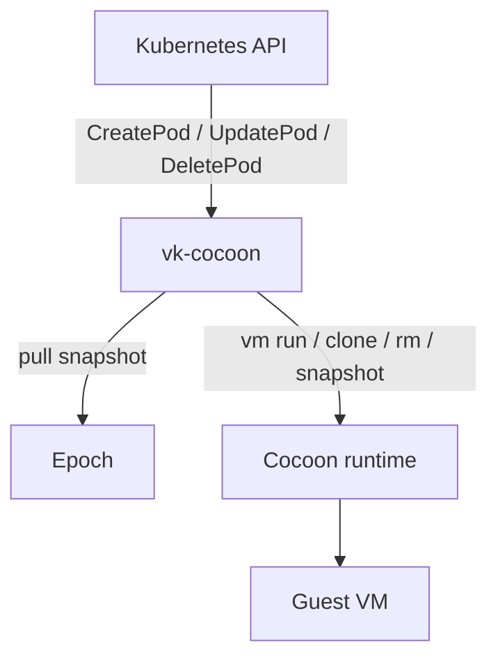

# vk-cocoon

`vk-cocoon` is a Virtual Kubelet provider for running Kubernetes pods as Cocoon-managed MicroVMs. It maps pod lifecycle events to VM operations such as run, clone, restore, snapshot, hibernate, and delete.

This public bundle contains the provider and generic examples only. It intentionally excludes internal bootstrap scripts, agent templates, and private runtime payloads.

## Scope

- pod-to-VM lifecycle mapping
- snapshot-aware create and recovery
- Windows and Linux guest support
- `kubectl exec`, `logs`, `attach`, and `port-forward` bridges
- integration with `epoch` for remote snapshot pulls
- optional integration with `cocoon-operator`, `cocoon-webhook`, and `glance`

External dependencies:

- `cocoon`
- `cloud-hypervisor`
- a Kubernetes cluster with Virtual Kubelet support

Those dependencies are not bundled in this public export.

## Architecture

## Pod Modes

| Annotation | Meaning |
|---|---|
| `cocoon.cis/mode=clone` | clone from a local or remote snapshot |
| `cocoon.cis/mode=run` | boot directly from an image |
| `cocoon.cis/mode=adopt` | attach an already existing VM |
| `cocoon.cis/mode=static` | represent an externally managed VM |

Useful annotations:

| Annotation | Purpose |
|---|---|
| `cocoon.cis/image` | snapshot name or image reference |
| `cocoon.cis/os` | guest OS type, for example `linux` or `windows` |
| `cocoon.cis/storage` | requested guest disk size |
| `cocoon.cis/managed` | marks pods managed by Cocoon |
| `cocoon.cis/vm-name` | stable VM name used for restart recovery |
| `cocoon.cis/fork-from` | source VM for live-fork scenarios |

## Examples

- [manifests/test-ubuntu.yaml](./manifests/test-ubuntu.yaml)
- [manifests/windows-vm.yaml](./manifests/windows-vm.yaml)
- [manifests/test-cocoonset.yaml](./manifests/test-cocoonset.yaml)

## Related Components

- `epoch`: snapshot registry
- `cocoon-operator`: `CocoonSet` and `Hibernation` controllers
- `cocoon-webhook`: optional sticky scheduling webhook
- `glance`: cluster dashboard for SSH, RDP, and VNC access

## License

MIT
